<div align="center">

# `KAIDRIX`

**Developer · Automation · Web &amp; Bot Projects**

```text
kaidrix306@github ~ $ whoami
KAIDRIX

kaidrix306@github ~ $ status
[ online ]  [ building ]  [ automating ]
```

<table>
<tr>
<td valign="top" width="48%"></td>
<td valign="top" width="52%"></td>
</tr>
</table>

<br>

### `kaidrix306@github ~ $ contributions`



> Contribution art is refreshed automatically by GitHub Actions.

### `kaidrix306@github ~ $ links`

[](https://github.com/kaidrix306)

### `kaidrix306@github ~ $ stack`

```text
WEB          ████████████████████
AUTOMATION   ██████████████████░░
BOTS         █████████████████░░░
TOOLS        ████████████████░░░░
```

<sub>Built with self-hosted SVG art, Python generators, and GitHub Actions.</sub>

</div>
